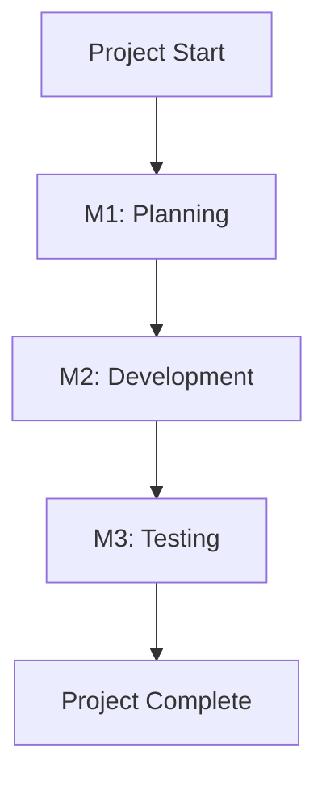

## Overview

Pavel Melnik provides powerful tools to streamline your team's workflow. You assign tasks, collaborate in real-time, set milestones, and monitor progress through intuitive dashboards. These features help teams deliver projects on time.

<Columns cols={2}>
  <Card title="Task Assignment" icon="check-square" href="#task-assignment">
    Assign tasks to team members with deadlines and priorities.
  </Card>
  <Card title="Collaboration Boards" icon="layout" href="#collaboration-boards">
    Use visual boards and comments for seamless teamwork.
  </Card>
  <Card title="Milestones and Deadlines" icon="calendar" href="#milestones">
    Track project phases and ensure timely delivery.
  </Card>
  <Card title="Reporting Dashboards" icon="bar-chart-3" href="#dashboards">
    Gain insights with customizable reports.
  </Card>
</Columns>

## Task Assignment and Tracking

Assign tasks effortlessly to keep your projects moving. Select assignees, set priorities, and track status changes in real-time.

<Steps>
  <Step title="Create a Task" icon="plus">
    Navigate to your project board and click "New Task". Enter details like title, description, and due date.
  </Step>
  <Step title="Assign and Prioritize" icon="user-check">
    Choose team members from the assignee dropdown. Set priority levels: low, medium, high, or urgent.
  </Step>
  <Step title="Track Progress" icon="eye">
    Monitor updates via notifications and status badges. Tasks move from "To Do" to "Done" automatically.
  </Step>
</Steps>

Integrate via API for automation:

<CodeGroup tabs="JavaScript,Python">
  ```javascript
  const response = await fetch('https://api.example.com/v1/projects/{projectId}/tasks', {
    method: 'POST',
    headers: { 'Authorization': 'Bearer YOUR_TOKEN', 'Content-Type': 'application/json' },
    body: JSON.stringify({
      title: 'Review designs',
      assigneeId: 'user-123',
      priority: 'high',
      dueDate: '2024-12-31'
    })
  });
  ```
  ```python
  import requests
  response = requests.post(
      'https://api.example.com/v1/projects/{projectId}/tasks',
      headers={'Authorization': 'Bearer YOUR_TOKEN', 'Content-Type': 'application/json'},
      json={
          'title': 'Review designs',
          'assigneeId': 'user-123',
          'priority': 'high',
          'dueDate': '2024-12-31'
      }
  )
  ```
</CodeGroup>

<ParamField path="projectId" param-type="string" required="true">
  Your project identifier.
</ParamField>

<ParamField body="assigneeId" param-type="string" required="false">
  ID of the team member.
</ParamField>

## Collaboration Boards and Comments

Foster teamwork with Kanban boards, lists, and inline comments. You visualize workflows and discuss changes without leaving the platform.

<Tabs>
  <Tab title="Kanban Boards" icon="grid">
    Drag tasks between columns like "Backlog", "In Progress", and "Review". Real-time updates sync across your team.
  </Tab>
  <Tab title="Comment Threads" icon="message-circle">
    Add comments to tasks with `@mentions` for notifications. Attach files up to 50MB.
  </Tab>
  <Tab title="Shared Lists" icon="list">
    Create custom lists for sprints or bug tracking. Filter by assignee or label.
  </Tab>
</Tabs>

<Callout kind="tip">
  Use `@team` to notify the entire group on critical updates.
</Callout>

## Milestone Setting and Deadlines

Define project milestones to break work into achievable phases. Set deadlines and track completion rates.



<Expandable title="Advanced Milestone Tips" default-open="false">

- Link milestones to tasks automatically.
- Set dependencies: M2 cannot start until M1 finishes.
- Receive alerts for approaching deadlines.

</Expandable>

## Basic Reporting Dashboards

Access at-a-glance insights with dashboards. Customize widgets for burndown charts, velocity, and task completion.

| Metric | Description | Default View |
|--------|-------------|--------------|
| Tasks Completed | Number of done tasks this week | Bar chart |
| Overdue Items | Tasks past due date | Table list |
| Assignee Workload | Tasks per team member | Pie chart |
| Sprint Velocity | Story points completed | Line graph |

<Callout kind="info">
  Export reports as PDF or CSV for stakeholder updates.
</Callout>

Build custom dashboards via API:

<Response tabs="Success,Error">
  ```json
  {
    "projectId": "proj-456",
    "metrics": {
      "completed": 25,
      "overdue": 2,
      "velocity": 40
    },
    "period": "weekly"
  }
  ```
  ```json
  {
    "error": "Invalid period",
    "code": 400
  }
  ```
</Response>

These features empower you to manage projects efficiently. Explore integrations in the [quickstart](/quickstart) for deeper automation.