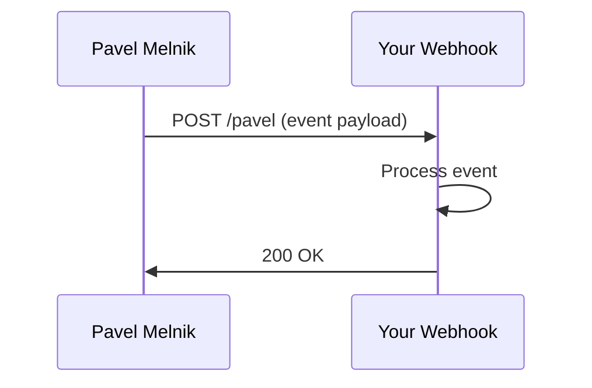

## Overview

Pavel Melnik integrates seamlessly with popular tools to streamline your team's workflow. Connect to communication apps like Slack, productivity suites like Google Workspace, and set up custom automations using webhooks and the API. This guide covers essential integrations, email notifications, webhook setup, and advanced custom options.

<Callout kind="info">
  All integrations require a Pavel Melnik API key. Generate one from your account settings at `https://dashboard.example.com/settings/api`.
</Callout>

## Popular Integrations

Start with these ready-to-use connections to boost productivity.

<Columns cols={3}>
  <Card title="Slack" icon="message-circle" href="https://slack.com/apps" target="_blank">
    Receive real-time notifications for task updates, mentions, and project milestones directly in your Slack channels.
  </Card>
  <Card title="Google Workspace" icon="google" href="https://workspace.google.com/marketplace" target="_blank">
    Sync calendars, drive files, and Gmail for seamless task assignment and document collaboration.
  </Card>
  <Card title="Email Notifications" icon="mail">
    Configure custom email alerts for deadlines and team assignments without third-party apps.
  </Card>
</Columns>

## Setting Up Webhooks

Webhooks let Pavel Melnik push events like `task.created` or `project.updated` to your endpoint in real time.

### Steps to Configure

<Steps>
  <Step title="Create Webhook" icon="plus">
    Navigate to `https://dashboard.example.com/settings/webhooks` and click "New Webhook".
    
    Enter your URL, e.g., `https://your-webhook-url.com/pavel`.
  </Step>
  <Step title="Select Events" icon="zap">
    Choose events like `task.completed` or `user.assigned`.
  </Step>
  <Step title="Verify and Test" icon="check-circle">
    Pavel Melnik sends a test payload. Respond with HTTP 200 to confirm.
  </Step>
</Steps>



### Handle Webhook Payloads

Use this example to process incoming webhooks.

<CodeGroup tabs="Node.js,Python">
  ```javascript
  const express = require('express');
  const app = express();
  app.use(express.json());

  app.post('/pavel', (req, res) => {
    const event = req.body;
    console.log(`Event: ${event.type}`, event.data);
    
    if (event.type === 'task.completed') {
      // Notify team
      sendSlackNotification(event.data.task.name);
    }
    
    res.status(200).send('OK');
  });

  app.listen(3000);
  ```
  ```python
  from flask import Flask, request, jsonify

  app = Flask(__name__)

  @app.route('/pavel', methods=['POST'])
  def webhook():
      event = request.json
      print(f"Event: {event['type']}", event['data'])
      
      if event['type'] == 'task.completed':
          # Notify team
          send_slack_notification(event['data']['task']['name'])
      
      return jsonify({'status': 'OK'}), 200

  if __name__ == '__main__':
      app.run(port=3000)
  ```
</CodeGroup>

<ParamField path="event" param-type="string" required="true">
  Webhook event type, e.g., `task.created`.
</ParamField>

<ParamField header="X-Pavel-Signature" param-type="string" required="true">
  HMAC signature for verifying authenticity. Compute using your webhook secret.
</ParamField>

## Email Notifications

Customize email alerts for your team.

<Tabs>
  <Tab title="SMTP Setup" icon="settings">
    Configure your SMTP server in dashboard settings.
    
    ```yaml
    smtp:
      host: smtp.gmail.com
      port: 587
      user: your-email@gmail.com
      pass: your-app-password
    ```
    
    Test with a sample notification.
  </Tab>
  <Tab title="Templates" icon="edit-3">
    Edit templates using Handlebars syntax.
    
    ```
    Hello {{user.name}},

    Task "{{task.name}}" is due soon.

    View: {{task.url}}
    ```
  </Tab>
</Tabs>

## Advanced Custom Integrations

For deeper customization, use the Pavel Melnik REST API.

<Expandable title="API Authentication Example" default-open="false">
  <CodeGroup tabs="cURL,JavaScript">
    ```bash
    curl -X POST https://api.example.com/v1/auth/token \
      -H "Content-Type: application/json" \
      -d '{
        "api_key": "YOUR_API_KEY"
      }'
    ```
    ```javascript
    const response = await fetch('https://api.example.com/v1/auth/token', {
      method: 'POST',
      headers: { 'Content-Type': 'application/json' },
      body: JSON.stringify({ api_key: 'YOUR_API_KEY' })
    });
    const { access_token } = await response.json();
    ```
  </CodeGroup>

  <ResponseField name="access_token" field-type="string" required="true">
    Bearer token for subsequent requests.
  </ResponseField>
</Expandable>

<Callout kind="tip">
  Explore the full API reference next. Start with creating a project via POST `/v1/projects`.
</Callout>